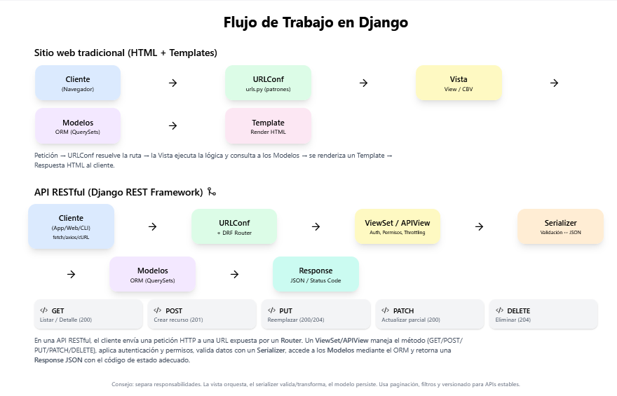

# ⚙️ Dinámica básica de trabajo con Django REST Framework



Cuando trabajamos con Django como **framework web** y en especial con **Django REST Framework (DRF)**, los componentes principales que intervienen son:

---

## 1) Models (Modelos)
- Definen la **estructura de datos** de la aplicación.
- Se escriben en `models.py` y usan el **ORM de Django**.
- Cada clase representa una tabla en la base de datos.

**Ejemplo**:
```python
from django.db import models

class Producto(models.Model):
    nombre = models.CharField(max_length=100)
    precio = models.DecimalField(max_digits=10, decimal_places=2)
    stock = models.IntegerField()
```

---

## 2) Serializers
- Son específicos de **DRF**.
- Se encargan de **convertir** los modelos en **JSON** (y viceversa).
- Definen qué campos se exponen en la API.

**Ejemplo**:
```python
from rest_framework import serializers
from .models import Producto

class ProductoSerializer(serializers.ModelSerializer):
    class Meta:
        model = Producto
        fields = ['id', 'nombre', 'precio', 'stock']
```

---

## 3) Views (Vistas)
- Manejan la **lógica de negocio** y cómo se procesan las solicitudes HTTP.
- En DRF se usan principalmente:
  - **APIView**: vistas personalizadas.
  - **ViewSet**: vistas agrupadas para CRUD rápido.

**Ejemplo con `ViewSet`**:
```python
from rest_framework import viewsets
from .models import Producto
from .serializers import ProductoSerializer

class ProductoViewSet(viewsets.ModelViewSet):
    queryset = Producto.objects.all()
    serializer_class = ProductoSerializer
```

---

## 4) URLs y Routers
- Conectan las vistas con las rutas HTTP.
- DRF simplifica esto con los **routers**.

**Ejemplo**:
```python
from django.urls import path, include
from rest_framework.routers import DefaultRouter
from .views import ProductoViewSet

router = DefaultRouter()
router.register(r'productos', ProductoViewSet)

urlpatterns = [
    path('api/', include(router.urls)),
]
```

---

## 5) Cliente (Frontend o API Consumer)
- Realiza solicitudes HTTP a los endpoints expuestos. Por ejemplo:
  - **GET** `/api/productos/` → lista todos los productos.
  - **POST** `/api/productos/` → crea un nuevo producto.
  - **GET** `/api/productos/{id}/` → obtiene un producto específico.
  - **PUT/PATCH** `/api/productos/{id}/` → actualiza un producto.
  - **DELETE** `/api/productos/{id}/` → elimina un producto.

---

# 🔄 Flujo de trabajo resumido
1. **Modelos** → definen las tablas de la base de datos.  
2. **Serializers** → transforman modelos ↔ JSON.  
3. **Views/ViewSets** → manejan la lógica y llamadas HTTP.  
4. **URLs/Routers** → exponen los endpoints.  
5. **Cliente** → consume la API con peticiones REST.  

---

## ✅ Consejos rápidos
- Usa **ViewSets + Routers** para CRUD estándar; recurre a **APIView** cuando necesites control fino.
- Implementa **autenticación/permiso** en DRF (`IsAuthenticated`, `DjangoModelPermissions`, etc.).
- Agrega **paginación**, **filtros** y **búsquedas** para APIs escalables.
- Separa responsabilidades: *la vista orquesta*, *el serializer valida/transforma* y *el modelo persiste*.

---

## ✅ Conclusión
Django REST Framework proporciona una manera **rápida y organizada** de construir **APIs RESTful**.  
Gracias al uso de **models, serializers, views y urls**, se puede desarrollar un CRUD completo con muy poco código, manteniendo la arquitectura limpia y escalable.

